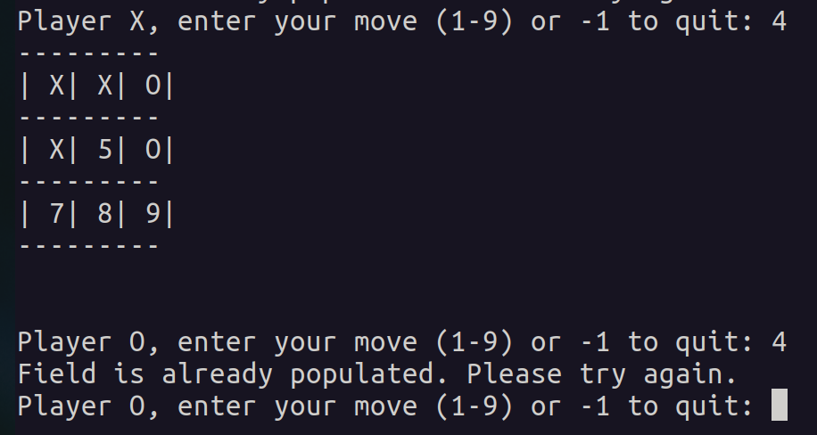
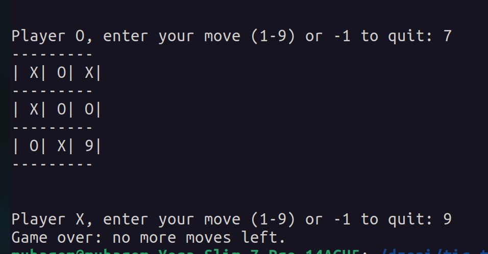
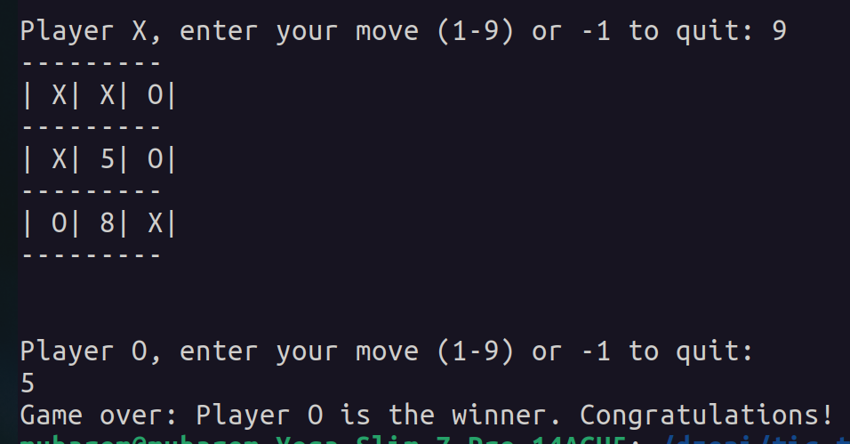
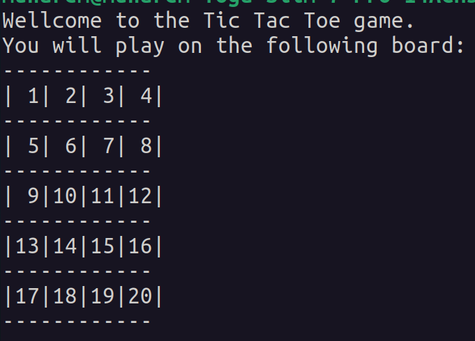
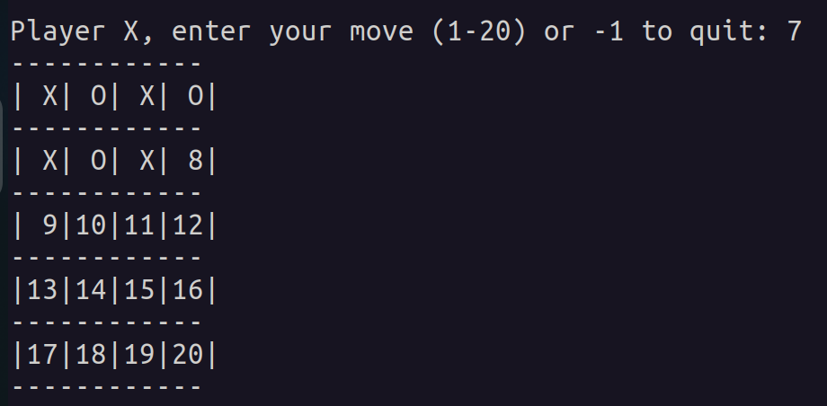

# Tic Tac Toe

A classic Tic Tac Toe game implemented in C++, playable directly from your terminal. 

By following this structured **Installation** section, you will be able to set up and run your Tic Tac Toe game with ease. 

## 🕹️ Features

- **Two-Player Mode:** Play against a friend by taking turns.
- **Input Validation:** Ensures players enter valid moves within the game board.
- **Win Detection:** Automatically detects and announces the winner or a draw.
- **Clear Terminal Interface:** Clean and intuitive display for an optimal user experience.

## 🛠️ Prerequisites

Before you begin, ensure you have met the following requirements:

- **Meson Build System:** Version 0.55.0 or later.
- **Ninja Build Tool:** Meson uses Ninja as its default backend.
- **C++ Compiler:** GCC, Clang, MSVC, or any other compatible compiler.

### Installing Meson and Ninja On Linux


```bash
sudo apt update
sudo apt install meson ninja-build
```

## 📦 Installation

Follow these steps to set up the project locally:

### 1. Clone the Repository

Use Git to clone the repository to your local machine:

```bash
git clone git@github.com:DzenanaK/TicTacToe.git
```

### 2. Navigate to directory

Navigate to the cloned project  directory:

```bash
cd tic-tac-toe
```

### 3. Set Up the Build Directory with Meson

Initialize the build directory using Meson and navigate to the build directory:

```bash
mkdir build
cd build
meson ..
```

### 4. Build project

Run ninja command in the build directory to build project

```bash
ninja 
```

## 🚀 Usage

Once you've successfully installed and built the Tic Tac Toe game, you're ready to play! Follow the steps below to start the game and enjoy a classic Tic Tac Toe experience right from your terminal.

From the build directory simply run the executable

```bash
./ticTacToe
```

### 🔍 Testing

Additionally, you can run the unit tests by executing the test binary which will show all test cases. 

```bash
./tests/TicTacToe/tic_tac_toe_test
```

or runing the ninja test command which will simply give final result 

```bash
ninja test 
```

## 📸 Screenshots






## ⚙️ Configuration

Customize the Tic Tac Toe board size by adjusting the `ROW` and `COL` parameters in the `include/ConstVariables.hpp` file. This flexibility allows you to create boards of varying dimensions.

### 📂 Location of Configuration File

The configurable parameters are located in the `ConstVariables.hpp` file within the `include` directory of the project.


### 📝 Configurable Parameters

- **ROW**
  - **Description:** Defines the number of rows in the Tic Tac Toe board.
  - **Default Value:** `3`
  - **Allowed Values:** Any integer **≥ 3**

- **COL**
  - **Description:** Defines the number of columns in the Tic Tac Toe board.
  - **Default Value:** `3`
  - **Allowed Values:** Any integer **≥ 3**

### 🔧 How to Modify `ROW` and `COL`

Follow these steps to customize the board size:

1. **Open `ConstVariables.hpp`:**

   Navigate to the `include` directory and open the `ConstVariables.hpp` file in your preferred text editor.

   ```bash
   cd TicTacToe/include
   nano ConstVariables.hpp
   
2. **Edit `ROW` and `COL` parameters to preferred values.**

3. **Save changes**

4. **Rebuild project as explained earlier**


## 📸 Updated Screenshot





## 📚 Additional Resources


- **[Meson Build System](https://mesonbuild.com/)**
  - An open-source build system focused on speed and user experience. Learn more about Meson to customize and extend your build configurations.

- **[Ninja Build System](https://ninja-build.org/)**
  - A small, fast build system that Meson uses as its default backend. Discover how Ninja can streamline your build process.
